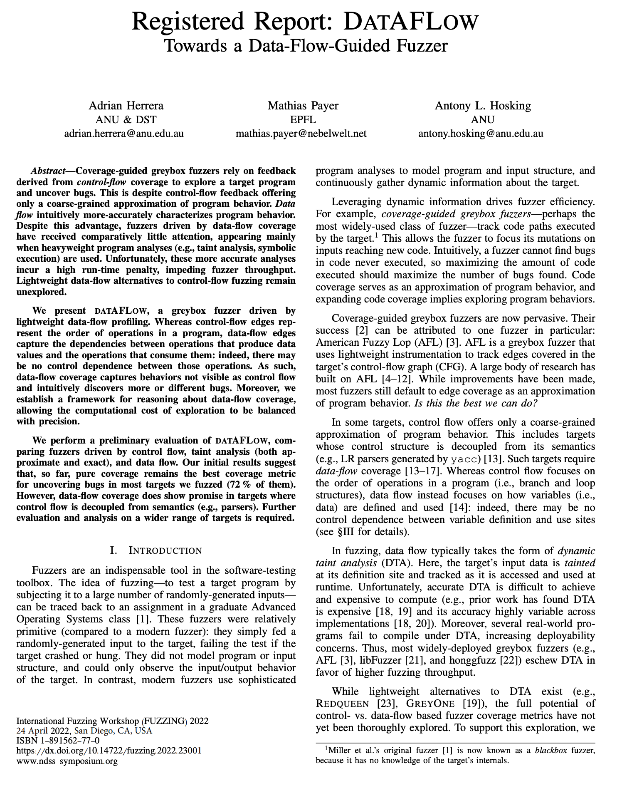

# datAFLow

<p>
<a href="https://www.ndss-symposium.org/wp-content/uploads/fuzzing2022_23001_paper.pdf" target="_blank">

</a>
</p>

DatAFLow is a fuzzer built on top of
[AFL++](https://github.com/AFLplusplus/AFLplusplus/). However, instead of a
control-flow-based feedback mechanism (e.g., based on control-flow edge
coverage), datAFLow uses a data-flow-based feedback mechanism; specifically,
data flows based on _def-use associations_.

To enable performant fuzzing, datAFLow uses a custom low-fat pointer memory
allocator for efficiently tracking data flows at runtime. This is achieved via
two mechanisms: a runtime replacement for malloc and friends, `libfuzzalloc`,
and a set of LLVM passes to transform your target to use `libfuzzalloc`.

More details are available in our registered report, published at the [1st
International Fuzzing Workshop (FUZZING)
2022](https://fuzzingworkshop.github.io/). You can read our report
[here](https://www.ndss-symposium.org/wp-content/uploads/fuzzing2022_23001_paper.pdf).

## Building

The `datAFLow` fuzzer requires a custom version of clang. Once this is built,
the `fuzzalloc` toolchain can be built. `FUZZALLOC_SRC` variable refers to this
directory.

### Patching clang

`fuzzalloc` requires a patch to the clang compiler to disable turning constant
arrays into packed constant structs.

To build the custom clang:

```bash
# Get the LLVM source code and update the clang source code
mkdir llvm
cd llvm
$FUZZALLOC_SRC/llvm-scripts/get_llvm_src.sh
$FUZZALLOC_SRC/llvm-scripts/update_clang_src.sh

# Build and install LLVM/clang/etc.
mkdir build
mkdir install
cd build
# If debugging you can also add -DCMAKE_BUILD_TYPE=Debug -DCOMPILER_RT_DEBUG=On
# Note that if you're going to use gclang, things seem to work better if you use
# the gold linker (https://llvm.org/docs/GoldPlugin.html)
cmake ../llvm -DLLVM_ENABLE_PROJECTS="clang;compiler-rt"    \
    -DLLVM_BUILD_EXAMPLES=Off -DLLVM_INCLUDE_EXAMPLES=Off   \
    -DLLVM_TARGETS_TO_BUILD="X86"                           \
    -DCMAKE_INSTALL_PREFIX=$(realpath ../install)           \
    -GNina
cmake --build .
cmake --build . --target install

# Add the install directory to your path so that you use the correct clang
export PATH=$(realpath ../install):$PATH
```

### With AddressSanitizer (ASan)

Fuzzing is typically performed in conjunction with a
[sanitizer](https://github.com/google/sanitizers/wiki) so that "silent" bugs can
be uncovered. Sanitizers such as
[ASan](https://github.com/google/sanitizers/wiki/AddressSanitizer) typically
hook and replace dynamic memory allocation routines such as `malloc`/`free` so
that they can detect buffer over/under flows, use-after-frees, etc.
Unfortunately, this means that we lose the ability to track dataflow (as we
rely on the memory allocator to do this). Therefore, we must use a custom
version of ASan in order to (a) detect bugs and (b) track dataflow.

To build the custom ASan, run the following after running `get_llvm_src.sh` and
`update_clang_src.sh` above:

```bash
cd llvm
$FUZZALLOC_SRC/llvm-scripts/update_compiler_rt_src.sh
$FUZZALLOC_SRC/llvm-scripts/update_llvm_src.sh

# Build and install LLVM/clang/etc.
cd build
# If debugging you can also add -DCMAKE_BUILD_TYPE=Debug -DCOMPILER_RT_DEBUG=On
cmake ../llvm -DLLVM_ENABLE_PROJECTS="clang;compiler-rt"                \
    -DFUZZALLOC_ASAN=On -DLIBFUZZALLOC_PATH=/path/to/libfuzzalloc.so    \
    -DLLVM_BUILD_EXAMPLES=Off -DLLVM_INCLUDE_EXAMPLES=Off               \
    -DLLVM_TARGETS_TO_BUILD="X86" -DCMAKE_INSTALL_PREFIX=$(realpath ../install)
cmake --build .
cmake --build . --target install

# Make sure the install path is available in $PATH
export PATH=$(realpath ../install/bin):$PATH
```

Note that after building LLVM with the custom ASan, you will have to rebuild
fuzzalloc with the new clang/clang++ (found under `install/bin`).

### Building `z3`

Z3 is required if using [SVF](https://github.com/svf-tools/svf) for static
analysis.

```bash
git clone https://github.com/z3prover/z3
mkdir -p z3/build
cd z3/build
cmake .. \
    -DCMAKE_INSTALL_PREFIX=$(realpath ../install) -DZ3_BUILD_LIBZ3_SHARED=False
make -j
make install
```

### Building `fuzzalloc`

First, ensure all submodules are initialized.

```bash
cd $FUZZALLOC_SRC
git submodule update --init --recursive
```

Then build.

```bash
mkdir build
cd build
cmake $FUZZALLOC_SRC \
    -DCMAKE_C_COMPILER=clang -DCMAKE_CXX_COMPILER=clang++ \
    -DUSE_SVF=True -DZ3_DIR=/path/to/z3/install
make -j
```

## Usage

`libfuzzalloc` is a drop-in replacement for malloc and friends. When using
gcc, it's safest to pass in the flags

```bash
-fno-builtin-malloc -fno-builtin-calloc -fno-builtin-realloc -fno-builtin-free
```

All you have to do is link your target with `-lfuzzalloc`.

### Instrumenting a Target

The `dataflow-cc` (and `dataflow-cc++`) tools can be used as dropin replacements
for `clang` (and `clang++`).

Note that this typically requires running `dataflow-preprocess` before running
`dataflow-cc` to collect the allocation sites to tag.

### `dataflow-preprocess`

If the target uses custom memory allocation routines (i.e., wrapping `malloc`,
`calloc`, etc.), then a [special case
list](https://clang.llvm.org/docs/SanitizerSpecialCaseList.html) containing a
list of these routines should be provided to `dataflow-preprocess`. Doing so
ensures dynamically-allocated variable _def_ sites are appropriately tagged. The
list is provided via the `FUZZALLOC_MEM_FUNCS` environment variable; i.e.,
`FUZZALLOC_MEM_FUNCS=/path/to/special/case/list`. The special case list must be
formatted as:

```
[fuzzalloc]
fun:malloc_wrapper
fun:calloc_wrapper
fun:realloc_wrapper
```

The locations of variable tag sites are stored in a file specified by the
`FUZZALLOC_TAG_LOG` environment variable.

### `dataflow-cc`

`dataflow-cc` is a drop-in replacement for `clang`. To use the tag list
generated by `dataflow-preprocess`, set it in the `FUZZALLOC_TAG_LOG`
environment variable (e.g., `FUZZALLOC_TAG_LOG=/path/to/tags`).

Other useful environment variables include:

* `FUZZALLOC_FUZZER`: Sets the fuzzer instrumentation to use. Valid fuzzers
include: `debug-log` (logging to `stderr`. This requires `fuzzalloc` be built
in debug mode; i.e., with `-DCMAKE_BUILD_TYPE=Debug`), `AFL`, and `libfuzzer`.

* `FUZZALLOC_SENSITIVITY`: Sets the _use_ site sensitivity. Valid sensitivities
are: `mem-read`, `mem-write`, `mem-access`, `mem-read-offset`,
`mem-write-offset`, and `mem-access-offset`.
